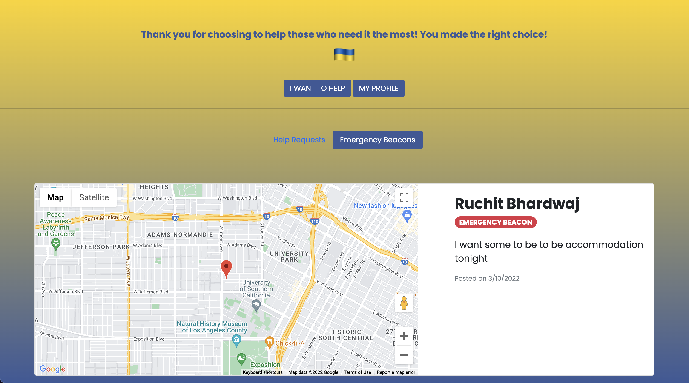
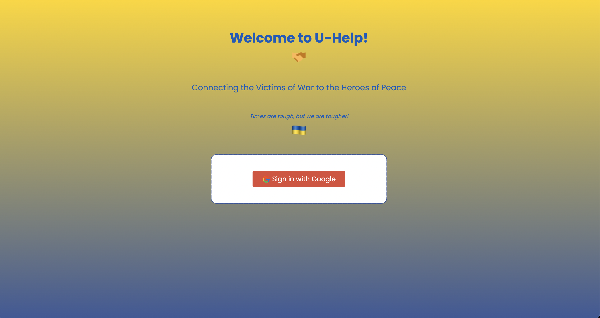
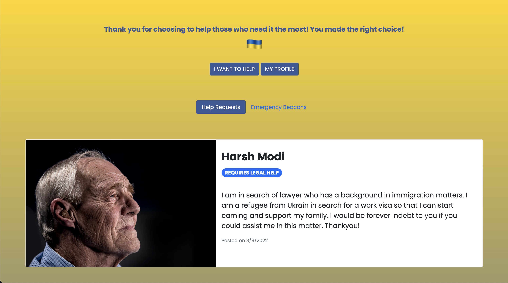
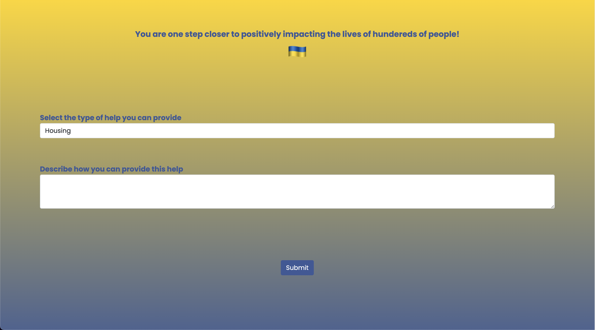
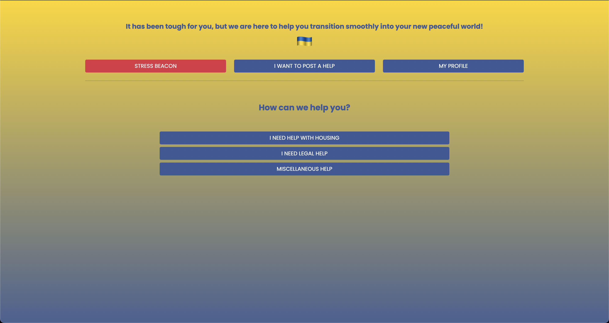
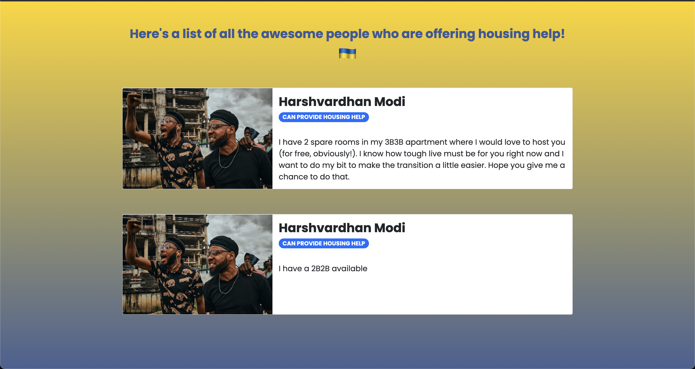
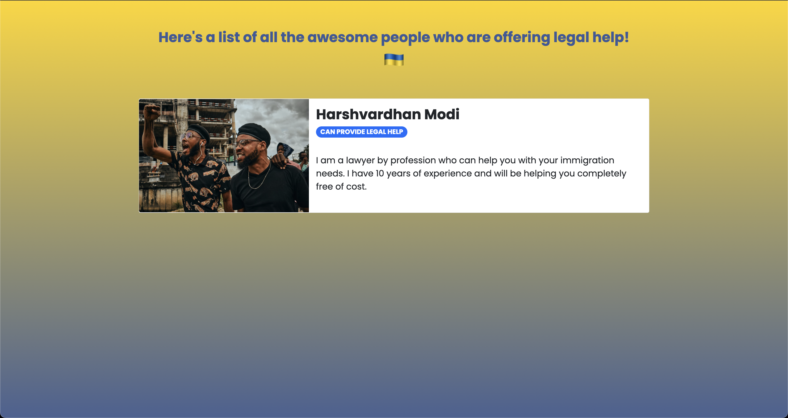
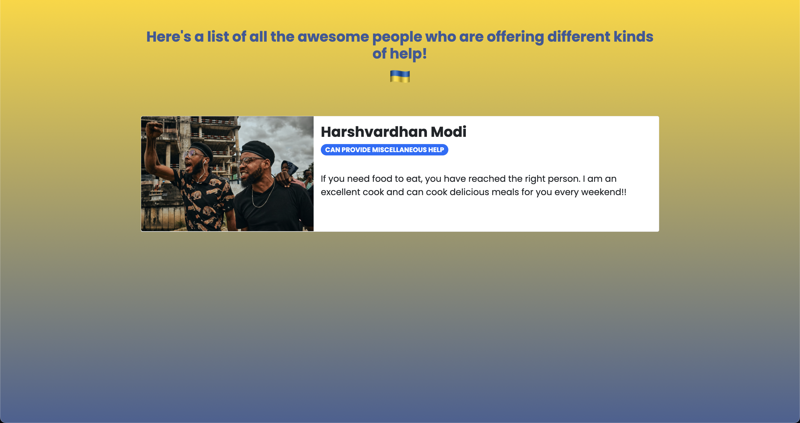
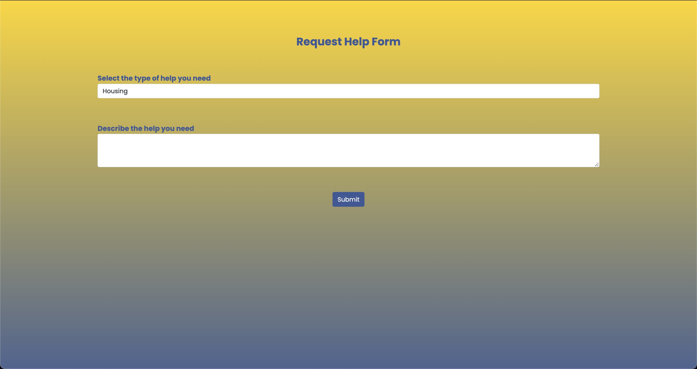
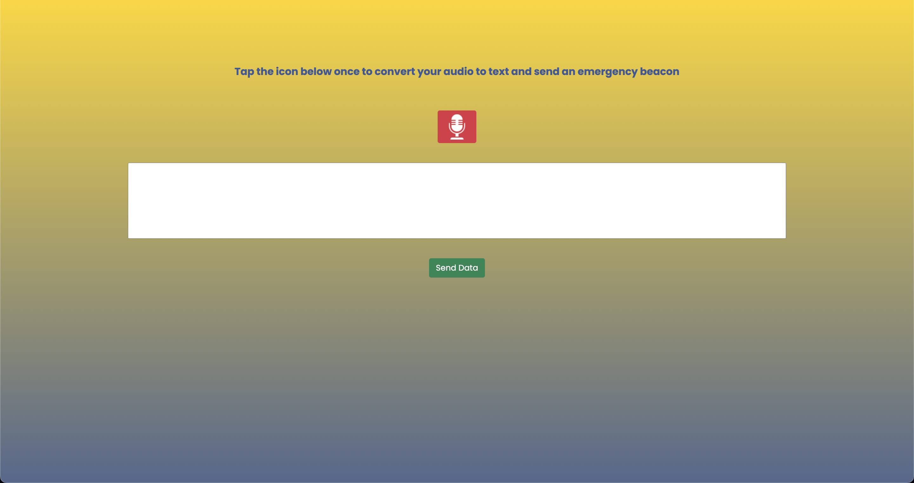

# U-Help

### Connecting victims of war to heroes of peace

---

## Demo 📈

---

## Devpost 📭

---

## Inspiration 💡

February 24, 2022 - Russia invades Ukraine. While we heard the headlines, the Ukrainian natives heard gun shots; while
we saw the news on TV, the Ukrainian natives experienced the blood bath in person; while we proposed expert advices on
government rulings from the comfort of our homes, somewhere in Ukraine, a child hugged his parents tighter, as the
family saw their homes being turned into shambles. 46 days later, the war continues. As leaders attempt to sort the
situation diplomatically, hundreds of family lose their homes with every passing hour. As of April 6th, 2022, more than
4.3 million people have left Ukraine to go as refugees to other countries such as Poland, Romania, Hungary, etc. We have
been reading this in news everyday but what we tend to forget is this - “Refugees didn’t just escape a place. They had
to escape a thousand memories until they’d put enough time and distance between them and their misery to wake to a
better day."

We believe that it is our legal and moral obligation, to help protect people fleeing bombs, bullets and tyrants and our
platform, U-Help, aims to bridge the gap between the seeker and the potential provider.

## What it does 🤔

U-Help provides a platform for the refugee to post about any sort of help that it may need such as housing problems,
legal problems, as well as any other miscellaneous problems. At the same time, voluntary helpers or, 'heroes of peace'
as we like to call them, can post about the type of help that they will be able to provide.

Our app is feature-rich and provides the following functionality -

- Refugees can list the kind of help that they require.
- Helpers can also post about the type of assistance that they can provide.
- The refugees can contact the potential helper calling them directly from within the application, or sending them an
  email.
- In case of an emergency, the refugees can trigger a 'beacon' which will allow them to record their problem.
- Registered helpers will receive a notification in the app, detailing more about the beacon, along with the precise
  location of where the beacon was generated from.
- Additionally, an email notification immediately sent to all prospective helpers as soon as a beacon is triggered.

## How we built it ⚙️

| Area     | Technology Used                                                   |
| -------- | ----------------------------------------------------------------- |
| Frontend | `HTML`, `CSS`, `Javascript`, `Bootstrap`                          |
| Services | `Firebase`, `Google Cloud Platform`, `Google Maps Javascript API` |

## Research 📚

Research is the key to empathizing with the refugees: we identified the main areas where the refugees need major
assistance, and that paves the way for our whole project. Here are a few of the resources that were helpful to us —

- [shorturl.at/hwRT8](shorturl.at/hwRT8)
- [shorturl.at/dpvxT](shorturl.at/dpvxT)

## Inclusion Track

From the very beginning, our idea was always about helping people, esp. refugees in need and we are happy that we could
achieve that through our implementation as well. We are a team of 2, who had decided to build a platform for social
good! Hence, the platform would fall under the track of **social good**.

## Challenges we are targeting 💪

### MLH - Google Cloud Challenge

Our application is primarity built on Firebase, thus leveraging the salient features it provides. Our app makes use of
the following -

- Firebase authentication for logging into the application
- Firebase Cloud Messaging Service to send notifications via email when a beacon is triggered.
- Google Maps API for sending real-time beacon trigger location.
- Google Cloud integration to support Google Maps API.

### MLH - Most Creative Use of Github

GitHub was used to collaborate, push code, get feedback, and keep track of our code throughout the hackathon.

## Accomplishments that we're proud of ✨

With a bug idea, and only 2 members to implement it, we are proud that we could finish the project in time, which seemed
like a tough task as we had started out. We learnt a lot about different features provided by Firebase, along with the
versatility of the Google Maps API (integrated with the Google Cloud Platform). Also, working non-stop for 36 hours on a
single idea, and seeing it come to fruition in front of our eyes, always has it's adrenaline rush! :)

## Challenges we ran into 😤

This was our first time designing and incorporating an application using Firebase hence, reading and learning about it
from scratch was definitely a challenge.

## What we learned 🙌

Time management and scope limitation is the key to a successful completion and submission. Also, the entire process from
ideation to prototyping to implementation to execution, we were able to understand each step of the pipeline.

## What's next for U-Help ⏭️

The filtering and matching for refugee and helper can be improved and filtered based on geographic locations. On a
broader front, various U-Help can work with various NGOs to join resources to help serve refugees better.

## Warning ⚠️

---

🏮 `All API accesses have been revoked. The project cannot be tried hands-on. Please view the working video for the demo.`

---

## Gallery 📷

### Common

|  |
| :-----------------------------------: |
|              Login Page               |

### Helper Module

|  |
| :-------------------------------------: |
|           Helper Landing Page           |

|  |
| :-------------------------------------------------------------------------: |
|                         Helper (Provide Help Form)                          |

|  |
| :---------------------------------------------------: |
|            Helper Stress Beacon View Page             |

### Refugee Module

|  |
| :-----------------------------------------------------------: |
|                     Refugee Landing Page                      |

|  |
| :-----------------------------------------------------: |
|               Refugee House Help Listings               |

|  |
| :-----------------------------------------------------: |
|               Refugee Legal Help Listings               |

|  |
| :---------------------------------------------------------------------: |
|                   Refugee Miscellaneous Help Listings                   |

|  |
| :---------------------------------------------------------------------: |
|                     Request Help Form for Refugees                      |

|  |
| :-------------------------------------: |
|      Refugee Stress Beacon Feature      |
